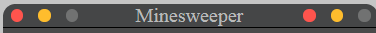

 
 
 ```html
 <body>
 <div class="layout-game">
```
 

  
  ```html
    <div class="game-header">
      <div class="round">
        <div class="bull red-bull "></div>
        <div class="bull yellow-bull "></div>
        <div class="bull grey-bull"></div>
      </div>
      <div class="title-game">Minesweeper</div>
      <div class="round">
        <div class="bull red-bull "></div>
        <div class="bull yellow-bull "></div>
        <div class="bull grey-bull"></div>
      </div>
    </div>
    
<style>
/* The layout of the header */
.game-header {
  display: flex;
  align-content: flex-start;
  border-bottom: 1px solid #000000;
  border-top-left-radius: 10px;
  border-top-right-radius: 10px;
  background-color: #454647;
}

/*
 The layout 3 bolls direct child of .game-header
*/
.round {
  width: 22%;
  display: flex;
  justify-content: space-around;
  align-items: flex-start;
}

.bull {
  border: 5px solid;
  align-self: center;
  border-radius: 100%;
}

.yellow-bull {
  border-color: #ffbd2d;
  background: #ffbd2d;
}

.red-bull {
  border-color: #fe544d;
  background: #fe544d;
}

.grey-bull {
  border-color: #717272;
  background: #717272;
}

/* the title minesweeper direct (/second) child of .game-header  */
.title-game {
  flex: 2;
  justify-content: center;
  font: bold;
  color: #b9baba;
  text-indent: 40px;
}
</style>
  ```


    <div class="flex-bord">
      <div class="information">
        <div class="level main-color border-color">
          <button class="btn level-btn active">Easy</button>
          <button class="btn level-btn">Hard</button>
          <button class="btn level-btn">Expert</button>
        </div>
        <!-- Level easy hard expert -->
        <div class="border panel border-color">
          <div class="score-timer placeholder digital-num">
            <div class="points"></div>
            <div class="digit ">888</div>
          </div>
          <!--Score-->
          <div class="smile">
            <button class="btn" id="smileBtn">Click me</button>

          </div>
          <!--SMILE-->
          <div class="score-timer placeholder digital-num">
            <div class="timer"></div>
            <div class="digit">888</div>
          </div>
        </div>
        <!--Timer-->
      </div>
      <!---Panel Timer Smile Score-->
      <div class="dashbourd-game" id="game"></div>
    </div>
    <!--Flex Board-->
  </div>
  <!--Layout-->

  <script src="./index.js"></script>
</body>
  ```