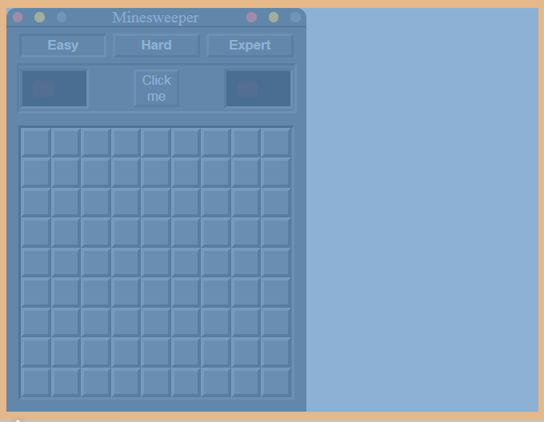
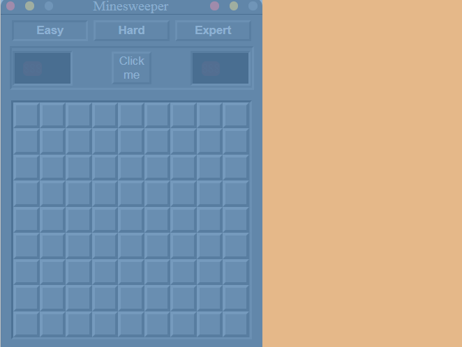
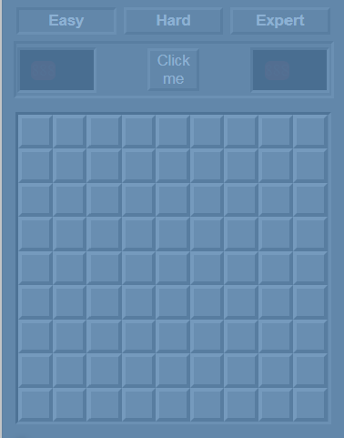
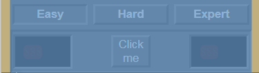

 
  
 ```html
 <body>
```



```html
<div class="layout-game">
```
The CSS
```css
.layout-game {
  display: flex;
  flex-flow: column wrap;
  width: 300px;
}
```

  
  ```html
    <div class="game-header">
      <div class="round">
        <div class="bull red-bull "></div>
        <div class="bull yellow-bull "></div>
        <div class="bull grey-bull"></div>
      </div>
      <div class="title-game">Minesweeper</div>
      <div class="round">
        <div class="bull red-bull "></div>
        <div class="bull yellow-bull "></div>
        <div class="bull grey-bull"></div>
      </div>
    </div>
  ```
The CSS  
```css
/* The layout of the header */
.game-header {
  display: flex;
  align-content: flex-start;
  border-bottom: 1px solid #000000;
  border-top-left-radius: 10px;
  border-top-right-radius: 10px;
  background-color: #454647;
}

/*
 The layout 3 bolls direct child of .game-header
*/
.round {
  width: 22%;
  display: flex;
  justify-content: space-around;
  align-items: flex-start;
}

.bull {
  border: 5px solid;
  align-self: center;
  border-radius: 100%;
}

.yellow-bull {
  border-color: #ffbd2d;
  background: #ffbd2d;
}

.red-bull {
  border-color: #fe544d;
  background: #fe544d;
}

.grey-bull {
  border-color: #717272;
  background: #717272;
}

/* the title minesweeper direct (/second) child of .game-header  */
.title-game {
  flex: 2;
  justify-content: center;
  font: bold;
  color: #b9baba;
  text-indent: 40px;
}
```
 

```html
    <div class="board-game">
```

Now his css 
```css
.board-game {
  display: flex;
  flex-flow: column wrap;
  background-color: #4a4a4a;
}
```

His first child
